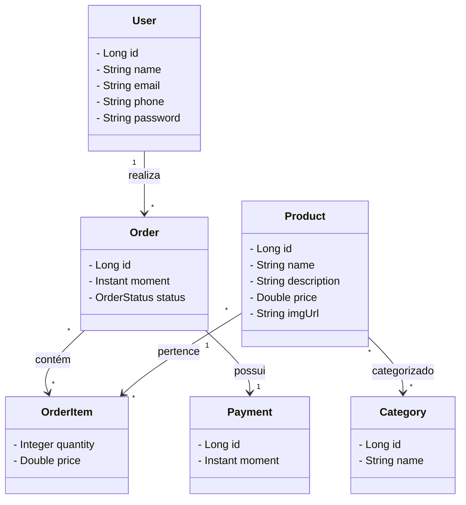

# Sistema de Gerenciamento de Pedidos  
@MateusAntony — Projeto Pessoal

API desenvolvida com **Spring Boot**, como parte dos meus estudos em backend Java. O projeto simula um sistema de vendas online, com modelagem de entidades como usuários, produtos, categorias, pedidos, itens de pedido e pagamentos. A aplicação foi construída com foco em organização, reutilização de código, uso de boas práticas REST e persistência com JPA.

Neste sistema:
- Usuários podem fazer pedidos contendo múltiplos produtos.
- Produtos pertencem a uma ou mais categorias.
- Cada pedido tem um status definido por `enum` e pode conter um pagamento associado.
- Os itens do pedido são representados por uma entidade intermediária com chave composta.


## Diagrama de Entidades

O projeto implementa um modelo relacional com os seguintes relacionamentos principais:



## Tecnologias

- Java  
- Spring Boot  
- Spring MVC  
- Spring Data JPA  
- H2 Database  
- JUnit 5  


## Práticas Adotadas

- Princípios SOLID  
- API RESTful com boas práticas  
- Injeção de dependência com Spring  
- Relacionamentos com JPA (`@OneToMany`, `@ManyToMany`, `@EmbeddedId`)  
- Enum para status de pedidos  
- Seed de dados com `@Profile("test")`  
- Testes com JUnit  


## API Endpoints

Para fazer as requisições HTTP abaixo, foi utilizada a ferramenta Postman.

### Criar Usuário
  
`POST - http://localhost:8080/users`  
```json
{
  "name": "Maria Brown",
  "email": "maria@email.com",
  "phone": "999999999",
  "password": "123456"
}
```

### Listar Produtos

`GET - http://localhost:8080/products`

### Criar Pedido

`POST - http://localhost:8080/orders`
```json
{
  "moment": "2023-07-10T12:30:00Z",
  "status": "PAID",
  "client": {
    "id": 1
  },
  "items": [
    {
      "product": { "id": 1 },
      "quantity": 2,
      "price": 90.5
    }
  ],
  "payment": {
    "moment": "2023-07-10T13:00:00Z"
  }
}
```
### Listar Pedidos

`GET - http://localhost:8080/orders`

## Como Executar

### Clonar o repositório:

A API estará disponível em: http://localhost:8080

```bash
git clone https://github.com/MateusAntony/Sistema-de-Gerenciamento-de-Pedidos.git
cd Sistema-de-Gerenciamento-de-Pedidos

```


